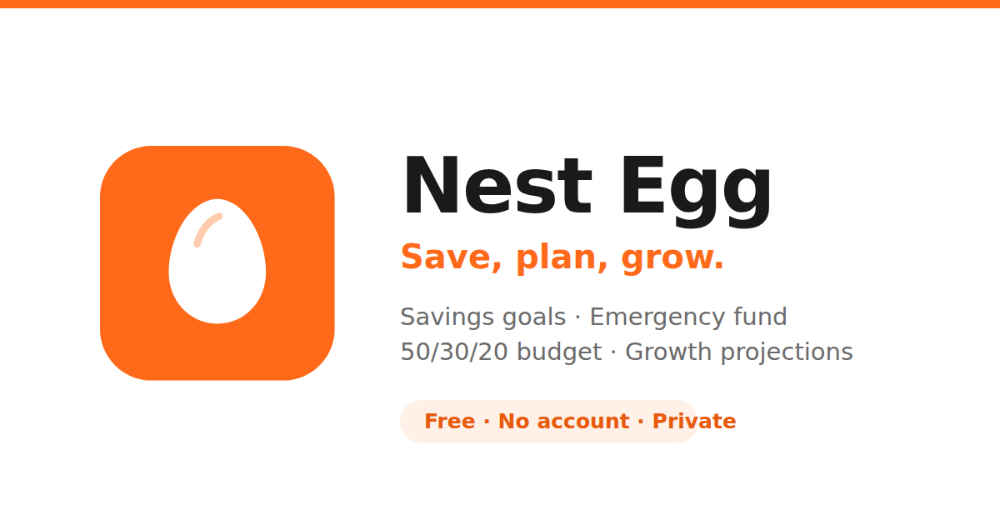

# Saverly

**Save, plan, grow.** A free, private savings planner that runs entirely in your browser.

👉 **[saverly.app](https://saverly.app)**

## What it does

- **Savings goals** with progress tracking and a monthly target for each one
- **Emergency fund planner** that works out your target from your actual essential expenses
- **50/30/20 budget** to split your income between needs, wants and savings
- **Growth projections** showing what your savings could become over time
- **Export and import** your data as a JSON file you keep

## Private by design

There are no accounts, no servers, no analytics, no trackers and no ads. Everything you enter is saved in your own browser's local storage, on your own device. Nothing is ever sent anywhere, because there is nowhere to send it.

That also means your data does not follow you between devices. Use **Export** on the Data tab to keep a backup, and **Import** to move it across.

## Works offline

Saverly is a progressive web app. Add it to your home screen and it opens in its own window and keeps working without a connection. On iPhone this also protects your saved data, since Safari clears storage for sites you have not opened in about a week.

## Built with

Plain HTML, CSS and JavaScript. No frameworks, no build step, no dependencies. Hosted on GitHub Pages.

## Not financial advice

Saverly is a planning tool. Its projections are simple estimates based on the figures you enter, assuming a constant rate of return and ignoring inflation, tax and fees. Real returns vary and you can lose money. For decisions about your money, speak to a qualified financial adviser.

See [Privacy & Terms](https://saverly.app/privacy.html).
